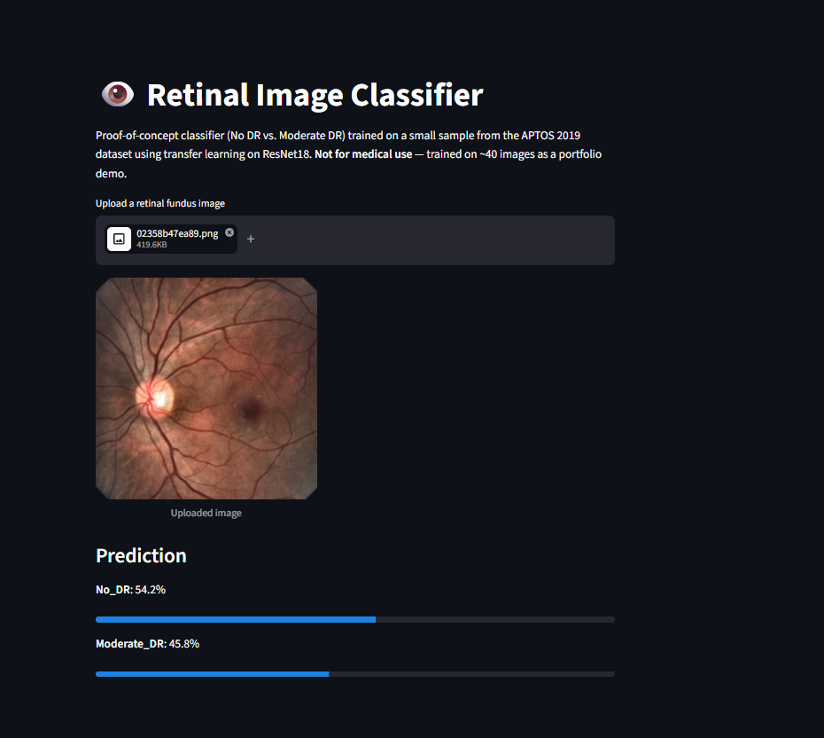

# Eye Vision Pipeline


Two small computer-vision proof-of-concepts exploring eye tracking
and retinal image analysis: a real-time gaze estimator (webcam +
MediaPipe) and a retinal fundus image classifier (PyTorch transfer
learning) deployed as a live Streamlit web app.

**Live demo:** [https://eye-vision-pipeline-8upzaawhrkdrwrly4ysysv.streamlit.app/](https://eye-vision-pipeline-8upzaawhrkdrwrly4ysysv.streamlit.app/)

## Modules

### `gaze_tracker/`
Real-time gaze direction estimation from a webcam feed.


- **Pipeline:** capture frame -> detect iris/eye-corner landmarks
  (MediaPipe Face Mesh, `refine_landmarks=True`) -> compute horizontal
  gaze ratio per eye -> classify as LEFT / RIGHT / CENTER -> overlay
  on video.
- **Run it:** `python -m gaze_tracker.main` (press `q` to quit, `l`
  to log a reading to `gaze_log.csv`)
- **Known limitations:** no per-user calibration, sensitive to head
  pose and lighting. A production system would calibrate per user
  and/or use a trained regression model instead of a fixed geometric
  threshold.

### `retinal_classifier/`
Binary classifier (No DR vs. Moderate DR) for retinal fundus images,
trained locally with PyTorch using transfer learning on a pretrained
ResNet18. See `retinal_classifier/README.md` for the full pipeline
walkthrough and dataset source.
- **Pipeline:** collect (APTOS 2019 sample, ~40 images) -> preprocess
  (OpenCV: crop, resize, CLAHE contrast enhancement) -> train
  (frozen ResNet18 backbone, retrained final layer) -> evaluate
  (80/20 train/val split) -> predict.
- **Train it:** `python -m retinal_classifier.train`
- **Predict locally:** `python -m retinal_classifier.predict_local --image <path>`
- Also includes `predict.py`, a ready-to-use client for an Azure
  Custom Vision prediction endpoint — written but not deployed (see
  Next steps).

### `app.py`
Streamlit web app wrapping the retinal classifier: upload a fundus
image, get live predictions in-browser. Deployed for free on
Streamlit Community Cloud, connected directly to this repo.



## Setup

**Web app / retinal classifier only (lighter install):**
```
git clone https://github.com/Edgezone-commits/eye-vision-pipeline.git
cd eye-vision-pipeline
pip install -r requirements.txt
streamlit run app.py
```

**Full local dev (includes gaze tracker):**
```
pip install -r requirements-dev.txt
python -m gaze_tracker.main
```

## Why these two modules

Built while exploring the core tools for an eye-tracking /
retinal-scanning computer vision role: OpenCV, MediaPipe, a deep
learning framework, and Azure. I hadn't worked with retinal imaging,
gaze estimation, or Azure Cognitive Services before this — the
project was a genuine hands-on first pass at all three, meant to
show I can pick up the exact tools a role needs quickly rather than
claim experience I don't have.

## Known limitations / next steps

- Gaze tracker has no per-user calibration and is sensitive to head
  pose/lighting.
- Retinal classifier was trained on ~40 images total as a
  proof-of-concept — not a clinically meaningful sample size. 100%
  validation accuracy reflects a tiny 8-image validation set, not a
  reliable performance estimate.
- Azure integration (`retinal_classifier/predict.py`) was written
  against the Custom Vision API but not deployed — a natural next
  step would be finishing that deployment, or moving to Azure ML for
  a fully custom-trained model on a larger dataset.
- No data augmentation or cross-validation yet.